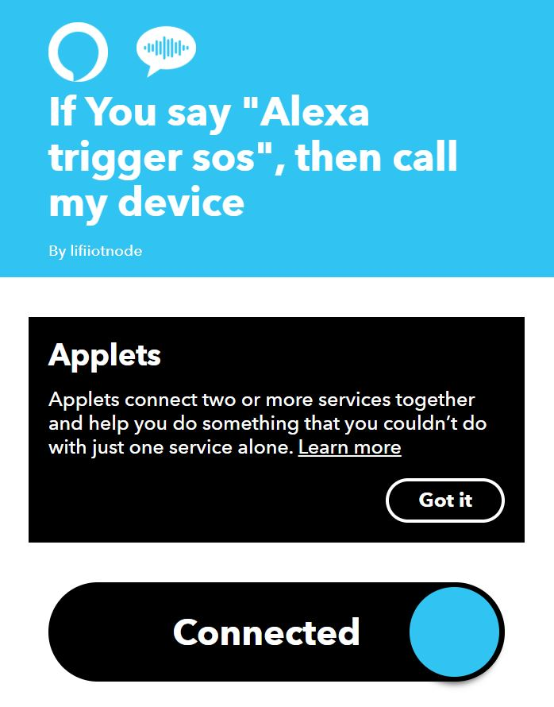

# letsTrain

***Description***
> Alexa is Amazon’s cloud based voice service, that helps users interact with brands, data, and business logic through voice. We use Alexa to innovate and build the next generation of interfaces for tourists in India.

> Our solution helps solve pain points of tourists coming to India like - voice forums to crowdsource destination reviews, GPS based voice navigators to guide tourists at historical sites, SOS and emergency support solutions for local and international travellers, travel guides with entry prerequisites, government policies, visa needs, and recommendations on seasons to visit.

> This Alexa based solution is intuitive to use and also caters to the physically challenged travellers in India.

***SOS and Emergency Support System***
> For building the SOS and emergency support service, we use IFTTT.
> As the user triggers the SOS message through his Alexa app, all the registered people having the IFTTT app in their phone receive a distress call for help through VoIP protocol. 

***Domain Bucket*** :
> Travel and Tourism

***Organisation*** :

> Amazon Web Services

***Category*** :
> Software

***Tech Stack*** :

- Python (as a language to write code)
- AWS Lambda (to execute the whole backend)
- Amazon Alexa (Amazon Developer Console was used to Create the whole working VUI)
- IFTTT - To create applets for Alexa
- VUI - Voice User Interface (to easily enable users to get a handsfree experience)
- VoIP Call (to trigger SOS and emergency support)
